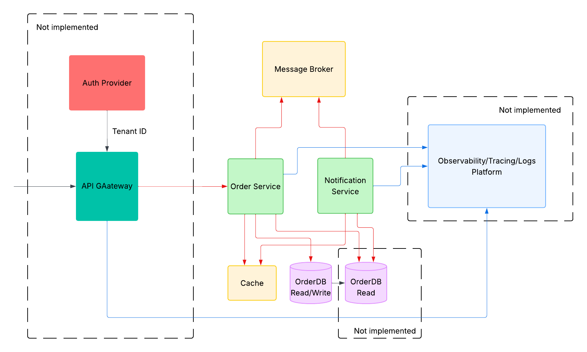

# Order Service System

## Table of Contents
1. [System Overview](#system-overview)
2. [Service Architecture](#service-architecture)
3. [Assumptions and Dependencies](#assumptions-and-dependencies)
4. [Getting Started](#getting-started)
5. [Running Tests](#running-tests)
6. [Running the Full System](#running-the-full-system)
7. [API Endpoints](#api-endpoints)
8. [Design Decisions and Tradeoffs](#design-decisions-and-tradeoffs)
9. [Information Security in Business Continuity Management](#information-security-in-business-continuity-management)

---

## Before you begin

- Containers build for **linux/arm64** platform
- The system is not fully implemented yet.
- Some ideas remained half implemented, like logging and tracing
- Something implemented not in the best way, like for the tracing in event driven communication better move to AOP to reduce code footprint.
- Please consider this project just an exercise how I would approach the problem
- CQRS pattern planned but not implemented 

Some useful links:
- Swagger UI (request examples and execution): http://localhost:8080/swagger-ui/index.html
- UI for Kafka (review Topics, messages, etc): http://localhost:8096
- H2 tcp url: jdbc:h2:tcp://localhost:9094/mem:orderdb


## System Overview



The Order Service is a **multi-tenant, event-driven microservices system** designed to manage order lifecycle operations including creation, updates, and cancellations. The system prioritizes data consistency, event-driven architecture, and graceful error handling using modern Spring Boot technologies.

### Key Capabilities
- **Multi-tenant Support**: Orders are isolated and managed within tenant contexts
- **Order Lifecycle Management**: Full state machine for order progression (CREATED → CONFIRMED → PAID → FULFILLED → SHIPPED → DELIVERED → COMPLETED)
- **Event-Driven Communication**: Kafka-based event streaming for asynchronous processing
- **Resilience & Retry Logic**: Built-in circuit breakers and retry mechanisms using Resilience4J
- **Distributed Tracing**: OpenTelemetry integration for observability
- **Caching Layer**: Redis-backed caching with Spring Cache abstraction for notification service # NOTE: Caching container is not a part of docker-compose due to lack of time
- **Comprehensive Logging**: Structured logging with contextual information

---

## Service Architecture

### Services

#### 1. **Order Service App** (`order-service-app`)
- **Port**: 8080
- **Responsibilities**:
  - RESTful API for order management (create, update, cancel)
  - Order persistence using Spring Data JPA with H2 database
  - Event publishing to Kafka `order-events` topic
  - Order state machine validation and transitions
  - Optimistic locking for concurrent updates
  - Multi-tenant context handling

- **Key Technologies**:
  - Spring Boot 4.0.7
  - Spring Data JPA (H2 embedded database)
  - Spring Cloud Stream + Kafka Binder
  - Resilience4J (circuit breaker, retry patterns)
  - OpenAPI/Swagger code generation
  - MapStruct for DTO mapping
  - Caffeine caching

#### 2. **Notification Service** (`notification-service`)
- **Port**: 8081
- **Responsibilities**:
  - Consumes order events from Kafka `order-events` topic
  - Caches orders in Redis for quick lookups
  - Handles Dead Letter Topic (DLT) for failed event processing
  - Manual acknowledgment of consumed messages
  - Redis-backed caching service

- **Key Technologies**:
  - Spring Boot 4.0.7
  - Spring Cloud Stream (Kafka consumer)
  - Spring Data Redis
  - Manual consumer acknowledgment
  - Dead Letter Topic (DLT) support

#### 3. **Common Logging Starter** (`common-logging-starter`)
- Shared logging configuration and utilities
- Provides a library for common logging patterns
- Spring Boot auto-configuration support

### External Dependencies

#### **Apache Kafka 4.1.0**
- Event broker for asynchronous communication
- Topics:
  - `order-events`: Main order event stream
  - `order-events.dlt`: Dead Letter Topic for failed processing
- **Health Check**: Kafka broker health verified via topic listing

#### **Kafka UI** (Optional Development Tool)
- Web interface for monitoring Kafka topics
- Port: 8096

#### **Redis** (Optional for Notification Service)
- Cache store for order data
- Default connection: `localhost:6379`
- Can be overridden via environment variables

#### **H2 Database** (Order Service)
- In-memory relational database for order storage
- Console accessible at `/h2-console`
- Auto-initialized from schema migrations

---

## Assumptions and Dependencies

### System Assumptions

1. **Multi-Tenant Isolation**: 
   - All requests must include `tenantId` in the URL path
   - Order data is logically isolated per tenant
   - No cross-tenant access or data sharing is permitted

2. **Event Delivery Guarantees**:
   - Kafka provides at-least-once delivery semantics
   - Event consumers must be idempotent
   - Dead Letter Topics capture permanently failed messages for analysis

3. **Optimistic Locking**:
   - Order updates use version-based optimistic locking
   - Version conflicts indicate concurrent modifications
   - Client must handle `409 Conflict` responses by retrying with refreshed data

4. **Order State Machine**:
   - Orders follow a strict forward-progression state machine
   - Backward state transitions are not allowed (except CANCELLED)
   - `CANCELLED` is a terminal state—no further transitions permitted
   - Specific states allow specific cancellations (CREATED, CONFIRMED, PAID only)

5. **Communication Preferences**:
   - Customer communication is tracked via preference (EMAIL or MAIL)
   - Notification service respects these preferences when processing events

### Technology Stack

| Component | Version | Purpose |
|-----------|---------|---------|
| Java | 25 | Language runtime (Virtual Threads enabled) |
| Spring Boot | 4.0.7 | Framework foundation |
| Spring Cloud | 2025.1.2 | Cloud-native patterns (Stream, Config) |
| Gradle | Latest | Build automation |
| Kafka | 4.1.0 | Event streaming |
| H2 | Latest | Order Service database |
| Redis | Latest | Notification Service cache (optional) |
| Resilience4J | 2.2.0 | Fault tolerance patterns |
| MapStruct | 1.6.3 | Object mapping |
| OpenAPI Generator | 7.10.0 | API code generation from specification |
| SpringDoc OpenAPI | 3.0.2 | API documentation (Swagger UI) |
| Micrometer OpenTelemetry | Latest | Distributed tracing and metrics |

### Required Dependencies Installation

```bash
# Java 25 (Virtual Threads support)
# Install via SDKMAN, Homebrew, or official installer

# Gradle (included via gradlew wrapper)
# Kafka (Docker)
# Redis (Docker - optional)
```

---

## Getting Started

### Prerequisites

- **Java 25** or higher (Virtual Threads support required)
- **Docker & Docker Compose** (for running full stack)
- **Git** (for version control)

### Clone and Build

```bash
# Clone the repository
git clone <repository-url>
cd order-service

# Build the entire project
./gradlew build

# Skip tests (if needed)
./gradlew build -x test
```

### Environment Configuration

#### Local Development

**Order Service** (`order-service-app/src/main/resources/application.yaml`):
```yaml
# Uses H2 in-memory database
# Kafka: localhost:9092
# Profile: default
```

**Notification Service** (`notification-service/src/main/resources/application.yaml`):
```yaml
# Redis: localhost:6379 (configurable via env vars)
# Kafka: localhost:9092
# Profile: default
```

#### Docker Environment

Set the active profile to `docker` for containerized deployments:
```bash
export SPRING_PROFILES_ACTIVE=docker
```

**Key Environment Variables for Docker**:
```bash
# Order Service
SPRING_PROFILES_ACTIVE=docker
APP_KAFKA_ORDER_EVENTS_BOOTSTRAP_SERVERS=kafka:29092
JAVA_TOOL_OPTIONS=-Xms128m -Xmx512m -XX:MaxMetaspaceSize=256m

# Notification Service
SPRING_PROFILES_ACTIVE=docker
APP_KAFKA_ORDER_EVENTS_BOOTSTRAP_SERVERS=kafka:29092
REDIS_HOST=redis
REDIS_PORT=6379
```

---

## Running Tests

### Unit Tests

Run unit tests for a specific service:

```bash
# All tests
./gradlew test

# Order Service tests only
./gradlew :order-service-app:test

# Notification Service tests only
./gradlew :notification-service:test

# With coverage
./gradlew test --continue
```

### Integration Tests

Tests use Spring Boot test starters and Cloud Stream test binder for Kafka mocking:

```bash
# Run integration tests
./gradlew :order-service-app:integrationTest
./gradlew :notification-service:integrationTest
```

### Test Configuration

**Test Resources** (`src/test/resources/`):
- `application-test.yaml`: Test-specific configurations
- Embedded H2 database for order service tests
- Spring Cloud Stream test binder mocks Kafka interactions
- Redis mock or embedded Redis for notification service tests

### Key Test Frameworks

- **JUnit 5**: Core test framework
- **Spring Boot Test**: Spring application testing
- **Spring Security Test**: Security layer testing
- **Spring Cloud Stream Test Binder**: Kafka mocking
- **Spring Boot Data JPA Test**: JPA layer testing

---

## Running the Full System

### Option 1: Docker Compose (Recommended)

```bash
# Build all Docker images first
./gradlew build -x test

# Build Docker images
docker build -t padbiarezski/order-service:latest -f order-service-app/dockerfile .
docker build -t padbiarezski/notification-service:latest -f notification-service/dockerfile .

# Start all services
docker-compose up -d

# View logs
docker-compose logs -f order-service
docker-compose logs -f notification-service
docker-compose logs -f kafka

# Stop all services
docker-compose down

# Clean up volumes and data
docker-compose down -v
```

### Option 2: Local Development (Manual)

#### Terminal 1: Start Kafka

```bash
# Option A: Docker Kafka only
docker run -d \
  --name kafka \
  -p 9092:9092 \
  -e KAFKA_NODE_ID=1 \
  -e KAFKA_PROCESS_ROLES=broker,controller \
  -e KAFKA_LISTENERS=PLAINTEXT://:9092,PLAINTEXT_INTERNAL://:29092,CONTROLLER://:9093 \
  -e KAFKA_ADVERTISED_LISTENERS=PLAINTEXT://localhost:9092,PLAINTEXT_INTERNAL://kafka:29092 \
  -e KAFKA_CONTROLLER_QUORUM_VOTERS=1@localhost:9093 \
  apache/kafka:4.1.0
```

#### Terminal 2: Start Order Service

```bash
./gradlew :order-service-app:bootRun \
  --args='--app.kafka.order-events.bootstrap-servers=localhost:9092'
```

Service available at: `http://localhost:8080`

#### Terminal 3: Start Notification Service (Optional)

```bash
./gradlew :notification-service:bootRun \
  --args='--spring.cloud.stream.kafka.binder.brokers=localhost:9092'
```

Service available at: `http://localhost:8081`

### Verifying System Health

```bash
# Order Service health
curl http://localhost:8080/actuator/health

# Order Service Kafka health
curl http://localhost:8080/actuator/health/kafka

# Notification Service health
curl http://localhost:8081/actuator/health

# Swagger UI
open http://localhost:8080/swagger-ui.html

# Kafka UI (if running)
open http://localhost:8096
```

### Sample Data and Requests

Reach Swagger UI to get all the API endpoints and test them interactively by the link: http://localhost:8080/swagger-ui/index.html.
Alternatively, you can use the following `curl` command to

Create a test order:

```bash
curl -X POST http://localhost:8080/api/v1/tenants/tenant-acme/orders \
  -H "Content-Type: application/json" \
  -d '{
    "customer": {
      "customerId": "cust-9001",
      "communicationPreference": "EMAIL",
      "email": "customer@loadup.com",
      "address": "742 Evergreen Terrace, Springfield"
    },
    "currency": "USD",
    "notes": "Leave at front desk",
    "items": [
      {
        "sku": "SKU-BOOK-001",
        "name": "Domain-Driven Design",
        "quantity": 1,
        "unitPrice": 44.99
      },
      {
        "sku": "SKU-MOUSE-002",
        "name": "Wireless Mouse",
        "quantity": 2,
        "unitPrice": 19.50
      }
    ]
  }'
```

---

## API Endpoints

### Base URL
```
http://localhost:8080/api/v1
```

### Order Management Endpoints

#### 1. Create Order
```
POST /tenants/{tenantId}/orders
```

**Request Headers**:
```
Content-Type: application/json
```

**Path Parameters**:
- `tenantId` (string, required): Tenant identifier

**Request Body**:
```json
{
  "customer": {
    "customerId": "cust-9001",
    "communicationPreference": "EMAIL|MAIL",
    "email": "customer@loadup.com",
    "address": "742 Evergreen Terrace, Springfield"
  },
  "currency": "USD",
  "notes": "Optional delivery notes",
  "items": [
    {
      "sku": "SKU-BOOK-001",
      "name": "Product name",
      "quantity": 1,
      "unitPrice": 44.99
    }
  ]
}
```

**Response** (201 Created):
```json
{
  "tenantId": "tenant-acme",
  "orderId": "ord-8f6b63a1",
  "customerId": "cust-9001",
  "status": "CREATED",
  "currency": "USD",
  "totalAmount": 83.99,
  "items": [...],
  "createdAt": "2026-06-12T08:15:30Z",
  "updatedAt": "2026-06-12T08:15:30Z"
}
```

**Error Responses**:
- `400 Bad Request`: Validation failed (missing fields, malformed input)
- `404 Not Found`: Tenant or customer not found
- `409 Conflict`: Business rule conflict

---

#### 2. Update Order
```
PATCH /tenants/{tenantId}/orders/{orderId}
```

**Path Parameters**:
- `tenantId` (string, required): Tenant identifier
- `orderId` (string, required): Order identifier

**Request Body**:
```json
{
  "targetStatus": "PAID|CONFIRMED|FULFILLED|SHIPPED|DELIVERED|COMPLETED",
  "version": 3,
  "notes": "Optional update notes"
}
```

**Response** (200 OK):
```json
{
  "tenantId": "tenant-acme",
  "orderId": "ord-8f6b63a1",
  "customerId": "cust-9001",
  "status": "PAID",
  "currency": "USD",
  "totalAmount": 83.99,
  "items": [...],
  "createdAt": "2026-06-12T08:15:30Z",
  "updatedAt": "2026-06-12T08:25:06Z"
}
```

**Error Responses**:
- `400 Bad Request`: Validation failed
- `404 Not Found`: Order not found
- `409 Conflict`: Version mismatch (optimistic lock conflict)
- `422 Unprocessable Entity`: Invalid status transition

---

#### 3. Cancel Order
```
POST /tenants/{tenantId}/orders/{orderId}/cancel
```

**Path Parameters**:
- `tenantId` (string, required): Tenant identifier
- `orderId` (string, required): Order identifier

**Request Body** (Optional):
```json
{
  "reasonCode": "CUSTOMER_REQUEST",
  "reasonText": "Customer changed shipping address",
  "requestedBy": "support.agent@loadup.com"
}
```

**Response** (200 OK):
```json
{
  "tenantId": "tenant-acme",
  "orderId": "ord-8f6b63a1",
  "customerId": "cust-9001",
  "status": "CANCELLED",
  "currency": "USD",
  "totalAmount": 83.99,
  "items": [...],
  "createdAt": "2026-06-12T08:15:30Z",
  "updatedAt": "2026-06-12T08:40:55Z"
}
```

**Cancellation Rules**:
- Can only cancel orders in: `CREATED`, `CONFIRMED`, `PAID` states
- Cannot cancel: `SHIPPED`, `DELIVERED`, `COMPLETED`, or already `CANCELLED` orders
- `CANCELLED` is a terminal state—no further updates allowed

**Error Responses**:
- `400 Bad Request`: Validation failed
- `404 Not Found`: Order not found
- `409 Conflict`: Order state conflict
- `422 Unprocessable Entity`: Cannot cancel order in current state

---

### Order Status Lifecycle

```
CREATED
  ↓
CONFIRMED
  ↓
PAID
  ↓
FULFILLED
  ↓
SHIPPED
  ↓
DELIVERED
  ↓
COMPLETED

(From CREATED, CONFIRMED, or PAID → CANCELLED [terminal state])
```

### Actuator/Health Endpoints

```
GET /actuator/health                    # Overall health
GET /actuator/health/kafka              # Kafka broker connectivity
GET /actuator/health/binders            # Spring Cloud Stream binders
GET /actuator/metrics                   # Application metrics
GET /actuator/info                      # Application info
```

### API Documentation

Interactive Swagger UI available at:
```
http://localhost:8080/swagger-ui.html
```

Swagger JSON spec:
```
http://localhost:8080/v3/api-docs
```

---

## Design Decisions and Tradeoffs

### 1. Event-Driven Architecture

**Decision**: Use Kafka for asynchronous order event processing

**Rationale**:
- Decouples order service from notification and downstream systems
- Enables scalable, distributed processing
- Provides audit trail of all order events
- Supports eventual consistency across services

**Tradeoff**:
- +  High throughput, low latency, async processing
- +  System resilience (services can fail independently)
- -  Eventual consistency (real-time consistency not guaranteed)
- -  Complexity in debugging cross-service issues

---

### 2. Multi-Tenant Architecture

**Decision**: Implement tenant-scoped data isolation at API and application layer

**Rationale**:
- Supports SaaS model with shared infrastructure
- Ensures data privacy and security boundaries
- Simplifies per-tenant configuration and scaling
- Enables compliance with data residency requirements

**Tradeoff**:
- +  True multi-tenancy support
- +  Cost efficiency with shared resources
- -  Requires discipline in query filters and caching
- -  Added complexity in test data management

---

### 3. Optimistic Locking for Concurrency Control

**Decision**: Use version-based optimistic locking instead of pessimistic locking

**Rationale**:
- Avoids database row locks and contention
- Supports better concurrency for read-heavy workloads
- Simplifies distributed transaction handling
- Reduces deadlock risk

**Tradeoff**:
- +  Higher concurrency throughput
- +  No distributed locking complexity
- -  Client must handle and retry on conflicts (409)
- -  Lost update scenario requires version-aware clients

---

### 4. Embedded H2 Database for Order Service

**Decision**: Use in-memory H2 database for development/testing

**Rationale**:
- Zero external dependencies for local development
- Fast test execution
- Easy to initialize and reset
- Adequate for proof-of-concept and testing

**Tradeoff**:
- +  Simplified local development setup
- +  Fast test execution
- -  Not suitable for production (data not persisted)
- -  Production requires migration to PostgreSQL/MySQL

---

### 5. Redis Caching in Notification Service

**Decision**: Use Redis for order caching with Spring Cache abstraction

**Rationale**:
- Reduces latency for repeated order lookups
- Supports cache invalidation strategies
- Spring Cache abstraction provides pluggable backends
- Enables distributed caching for scaled deployments

**Tradeoff**:
- +  High-performance lookups
- +  Supports cache TTL and eviction policies
- -  Additional operational dependency (Redis)
- -  Cache invalidation complexity

---

### 6. Resilience4J for Fault Tolerance

**Decision**: Use Resilience4J for circuit breaker and retry patterns

**Rationale**:
- Lightweight, Java-native fault tolerance
- Fine-grained configuration per operation
- No external dependencies (embedded in service)
- Good integration with Spring Boot

**Tradeoff**:
- +  Prevents cascading failures
- +  Supports gradual recovery (half-open state)
- -  Requires careful configuration tuning
- -  Must handle fallback scenarios in code

**Configuration**:
```yaml
retry:
  orderCacheRetry:
    max-attempts: 3
    wait-duration: 100ms
    
circuitbreaker:
  orderCacheCircuitBreaker:
    failure-rate-threshold: 50%
    wait-duration-in-open-state: 30s
```

---

### 7. Manual Kafka Consumer Acknowledgment

**Decision**: Use manual acknowledgment mode in notification service

**Rationale**:
- Ensures events are only marked consumed after processing
- Enables dead letter topic routing for permanently failed events
- Prevents data loss on consumer crashes
- Supports exactly-once processing semantics (with idempotency)

**Tradeoff**:
- +  Data loss prevention
- +  Failed event tracking via DLT
- -  Consumer must track offsets manually
- -  Requires idempotent event handlers

---

### 8. Code Generation from OpenAPI Specification

**Decision**: Use OpenAPI Generator to generate API interfaces and DTOs

**Rationale**:
- Single source of truth for API contract
- Automatic model validation annotations
- Type-safe client code generation
- Swagger UI auto-generation

**Tradeoff**:
- +  API consistency across services
- +  Documentation always in sync
- -  Generated code is read-only (modifications risky)
- -  Learning curve for OpenAPI specification

---

### 9. Virtual Threads (Java 21+)

**Decision**: Enable Spring Boot virtual threads for lightweight concurrency

**Rationale**:
- Reduces thread pool size requirements
- Lower memory footprint per request
- Simplified async programming model
- Better CPU utilization

**Tradeoff**:
- +  Higher request throughput with fewer resources
- +  Simplified code (no reactive programming needed)
- -  Requires Java 21+ runtime
- -  Thread-local storage patterns may break

---

### 10. Structured Logging with Contextual Information

**Decision**: Implement structured logging with tenant context and trace IDs

**Rationale**:
- Enables efficient log aggregation and searching
- Supports correlation of related events across services
- Simplifies distributed tracing and debugging
- Better machine-readability for log analysis tools

**Tradeoff**:
- +  Better observability
- +  Easier root cause analysis
- -  Requires consistent context propagation
- -  Additional logging configuration complexity

---

## Information Security in Business Continuity Management

### 1. Security Architecture

#### Multi-Tenant Isolation
- **Principle**: Each tenant's data is isolated at the application layer
- **Implementation**:
  - `tenantId` parameter required in all API paths
  - Database queries filtered by tenant context
  - Cache keys include tenant identifier
  - No cross-tenant data queries permitted

- **Controls**:
  - Tenant context validation on every request
  - Audit logging of all cross-tenant access attempts
  - Testing enforces tenant isolation

#### Authentication & Authorization (Future Implementation)
- **Current State**: Security is commented out in dependencies (Spring Security)
- **Recommended Approach**:
  - Implement OAuth 2.0 / OpenID Connect for authentication
  - JWT tokens with tenant claims
  - Role-based access control (RBAC) per tenant
  - API key validation for service-to-service communication

#### Data Protection
- **Encryption in Transit**:
  - TLS/SSL for all API endpoints (HTTPS)
  - Kafka SSL/TLS for event streaming
  - Secure Redis connection with authentication

- **Encryption at Rest** (Production):
  - Database encryption using native database capabilities
  - Redis persistence with encryption
  - Secrets management (HashiCorp Vault, AWS Secrets Manager)

---

### 2. Business Continuity & Disaster Recovery

#### Resilience Patterns

**Circuit Breaker Pattern**:
```yaml
resilience4j:
  circuitbreaker:
    orderCacheCircuitBreaker:
      failure-rate-threshold: 50%
      wait-duration-in-open-state: 30s
```
- Prevents cascading failures
- Automatic recovery attempt after delay
- Monitoring alerts on circuit state changes

**Retry with Exponential Backoff**:
```yaml
retry:
  orderCacheRetry:
    max-attempts: 3
    wait-duration: 100ms
```
- Automatic recovery from transient failures
- Configurable retry limits to prevent resource exhaustion

**Dead Letter Topic (DLT)**:
- Kafka DLT captures permanently failed events
- Manual analysis and replay capability
- Prevents data loss and enables post-incident recovery

#### Database Backup Strategy

**For Production**:
- **Order Service Database** (PostgreSQL recommended):
  - Automated daily backups with point-in-time recovery
  - Cross-region replication for disaster recovery
  - Regular backup testing and validation

- **Redis Cache**:
  - Regular RDB (Redis Database) snapshots
  - AOF (Append Only File) persistence for write durability
  - Replication to standby instances

- **Kafka Topics**:
  - Minimum replication factor of 3 in production
  - Retention policy appropriate for audit requirements
  - Regular topic backup export

#### Service Recovery Procedures

**Order Service Recovery** (RTO: <5 minutes):
1. Health checks detect service failure
2. Kubernetes pod restart (if deployed on K8s)
3. Database recovery from latest backup if needed
4. Event stream resume from last committed offset
5. Reconciliation of in-flight transactions

**Notification Service Recovery** (RTO: <5 minutes):
1. Service restart
2. Kafka consumer group resumes from last committed offset
3. Cache rebuild from order service on first access
4. Automatic retry of unacknowledged events

**Kafka Cluster Recovery** (RTO: <30 minutes):
1. Broker health monitoring
2. Automatic leader election for failed brokers
3. Consumer lag monitoring and alerting
4. Manual intervention for partition re-assignment if needed

---

### 3. Monitoring & Alerting

#### Key Metrics to Monitor

```
Application Level:
- Order creation rate (orders/sec)
- Order update rate (updates/sec)
- API response latency (p50, p95, p99)
- Error rate by endpoint
- Request rate by tenant
- Cache hit ratio (Notification Service)

Kafka Level:
- Consumer lag per consumer group
- Topic message rate
- Producer throughput
- Dead Letter Topic message count
- Partition replica status

Infrastructure Level:
- CPU utilization
- Memory usage
- Disk I/O
- Network latency
- Database connection pool utilization
```

#### Health Checks

**Actuator Endpoints**:
```
GET /actuator/health              # Overall system health
GET /actuator/health/kafka        # Kafka connectivity
GET /actuator/health/binders      # Stream binder status
GET /actuator/health/db           # Database connectivity (Order Service)
GET /actuator/health/redis        # Redis connectivity (Notification Service)
```

#### Alerting Rules (Examples)

```
CRITICAL:
- Service health check failed for >1 minute
- Kafka broker unreachable
- Database connection pool exhausted
- Circuit breaker in OPEN state >5 minutes
- Dead Letter Topic message count spike

WARNING:
- Consumer lag >10,000 messages
- API p99 latency >1 second
- Error rate >1%
- Cache hit ratio <50%
- Service memory usage >80%
```

---

### 4. Audit & Compliance

#### Event Audit Trail

**Kafka Event Topics** serve as immutable audit log:
- Order creation events with full payload
- Status transition events with version numbers
- Cancellation events with reason codes
- Failed events in Dead Letter Topic
- Timestamp and trace ID on every event

#### Structured Logging

```json
{
  "timestamp": "2026-06-12T08:15:30Z",
  "traceId": "75bfa3de01484f31",
  "tenantId": "tenant-acme",
  "orderId": "ord-8f6b63a1",
  "operation": "CREATE_ORDER",
  "customerId": "cust-9001",
  "status": "CREATED",
  "ipAddress": "192.168.1.1",
  "userId": "user-123",
  "result": "SUCCESS"
}
```

#### Compliance Considerations

- **GDPR**: Right to be forgotten requires careful event retention policies
- **SOC 2**: Comprehensive audit trail maintained in Kafka
- **PCI DSS**: Payment-related events segregated and encrypted
- **Data Residency**: Tenant data remains within configured region

---

### 5. Threat Mitigation

#### API Security

| Threat | Mitigation |
|--------|-----------|
| Unauthorized Access | API key validation, OAuth2 tokens, JWT validation |
| SQL Injection | Parameterized queries (Spring Data JPA) |
| Cross-Site Scripting (XSS) | Input validation, output encoding |
| CSRF | CSRF token validation (Spring Security) |
| Rate Limiting | API gateway rate limiting, tenant quota enforcement |
| DDoS | Load balancer, WAF, Kafka partition scaling |

#### Data Security

| Control | Implementation |
|---------|----------------|
| Encryption in Transit | TLS 1.3 for all connections |
| Encryption at Rest | Database and Redis encryption |
| Secrets Management | Environment variables, secrets vault |
| Access Control | RBAC, tenant isolation, audit logging |
| Data Masking | PII masking in logs, secure cache keys |

#### Infrastructure Security

| Layer | Control |
|-------|---------|
| Network | VPC isolation, security groups, private subnets |
| Container | Image scanning, resource limits, read-only filesystem |
| Orchestration | RBAC policies, network policies, pod security policies |
| Database | Encrypted connections, strong auth, IP whitelisting |
| Kafka | TLS/SSL, SASL authentication, ACLs |

---

### 6. Incident Response & Recovery

#### Incident Classification

```
SEVERITY 1 (Critical):
- Service completely down (RTO <5 min)
- Data loss or corruption
- Security breach detected
→ Immediate escalation, all-hands response

SEVERITY 2 (High):
- Service degraded (RTO <30 min)
- Elevated error rates (>5%)
- Consumer lag >100k messages
→ Rapid response team activation

SEVERITY 3 (Medium):
- Elevated latency (p99 >2s)
- Consumer lag >10k messages
- Single tenant affected
→ Standard response procedures

SEVERITY 4 (Low):
- Minor issues, monitoring only
- Cache inefficiency
- Non-critical feature unavailable
→ Backlog for next release
```

#### Recovery Procedures

**Database Corruption Recovery**:
1. Detect data anomaly via health checks
2. Restore from verified backup
3. Replay Kafka events from latest checkpoint
4. Reconcile in-flight transactions
5. Validate data consistency
6. Resume normal operations

**Kafka Consumer Lag Recovery**:
1. Identify slow or stuck consumers
2. Restart affected consumer instances
3. Monitor offset commit progress
4. If lag not decreasing, investigate DLT
5. Manual event replay if necessary

**Cross-Tenant Isolation Breach**:
1. Immediate service shutdown
2. Data forensics on audit logs
3. Identify affected tenants
4. Notify affected customers
5. Database audit and rollback
6. Security review and remediation
7. Controlled restart with enhanced validation

---

### 7. Security Best Practices Checklist

- [ ] All API endpoints require authentication (OAuth 2.0 / JWT)
- [ ] All requests validated against OpenAPI schema
- [ ] Input sanitization for all user-provided data
- [ ] Tenant context validated on every request
- [ ] Secrets rotated regularly (API keys, DB passwords)
- [ ] TLS 1.3+ enforced for all external connections
- [ ] Database connections use SSL/TLS
- [ ] Kafka producer/consumer use TLS and SASL authentication
- [ ] Redis connection authenticated and encrypted
- [ ] Regular security audits and penetration testing
- [ ] Dependency scanning for known vulnerabilities (OWASP)
- [ ] Log aggregation with secure access controls
- [ ] Distributed tracing correlation IDs in all logs
- [ ] Rate limiting and quota enforcement per tenant
- [ ] Database backup encryption and testing
- [ ] Disaster recovery procedures documented and tested
- [ ] Incident response plan with defined SLAs
- [ ] Regular chaos engineering tests
- [ ] Security training for development team

---

**Last Updated**: June 16, 2026  
**Version**: 1.0.0
